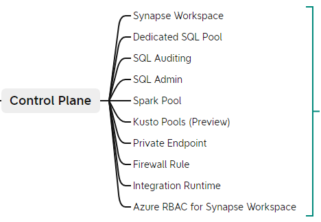

# Azure Synapse Workspace CICD Git Repo
This Git Repo is for Azure Synapse Analytics WorkSpace CI/CD. The deployment currently is only supported for Synapse Data Plane Components. I will add more components in the future release.

## What is Synapse CI/CD

In an Azure Synapse Analytics workspace, CI/CD moves all entities from one environment (development, test, production) to another environment. Promoting your workspace to another workspace is a two-part process. First, use an Azure Resource Manager template (ARM template) to create or update workspace resources (pools and workspace). Then, migrate artifacts like SQL scripts and notebooks, Spark job definitions, pipelines, datasets, and other artifacts by using **Synapse Workspace Deployment** tools in Azure DevOps or on GitHub.

In this current Git Repo, we will only focus on the deployment under **GitHub Action**.

## Synapse CI/CD Overview

XMind workflow screenshot as below (Click the picture to have original ovew): 


## What is Synapse Control Plane
Resources can be found directly from **Azure Portal**, like below screenshot:   


## What is Synapse Data Plane (Synapse Artifacts)

Resources can only be found from **Synapse Studio**, like below screenshot:   


## Resources in Git Repo
```
 ┣ 📂.github
 ┃ ┗ 📂workflows
 ┃ ┃ ┗ 📜SynapseDataPlaneCICD-main.yml
 ┣ 📂res
 ┃ ┗ 📂img
 ┃ ┃ ┣ 📜Azure Synapse AnalyticsCICDOverview.png
 ┃ ┃ ┣ 📜SynapseControlPlane.png
 ┃ ┃ ┗ 📜SynapseDataPlane.png
 ┣ 📂yuanxiadevopsasadev01
 ┃ ┣ 📂credential
 ┃ ┃ ┗ 📜WorkspaceSystemIdentity.json
 ┃ ┣ 📂dataset
 ┃ ┃ ┣ 📜AzureSynapseAnalyticsTable1.json
 ┃ ┃ ┣ 📜Json1.json
 ┃ ┃ ┗ 📜SqlPoolTable1.json
 ┃ ┣ 📂integrationRuntime
 ┃ ┃ ┣ 📜AutoResolveIntegrationRuntime.json
 ┃ ┃ ┗ 📜yuanxiadevopsasadev01-azureir01.json
 ┃ ┣ 📂linkedService
 ┃ ┃ ┣ 📜AzureDataLakeStorage1.json
 ┃ ┃ ┣ 📜AzureKeyVault1.json
 ┃ ┃ ┣ 📜AzureSynapseAnalytics1.json
 ┃ ┃ ┣ 📜SynapseServerlessSQLView.json
 ┃ ┃ ┣ 📜yuanxiadevopsasadev01-WorkspaceDefaultSqlServer.json
 ┃ ┃ ┣ 📜yuanxiadevopsasadev01-WorkspaceDefaultStorage.json
 ┃ ┃ ┗ 📜yuanxiadevopsasadev01AzureKeyVault1.json
 ┃ ┣ 📂pipeline
 ┃ ┃ ┣ 📜Pipeline 1.json
 ┃ ┃ ┣ 📜Pipeline 2.json
 ┃ ┃ ┣ 📜Pipeline 3.json
 ┃ ┃ ┗ 📜Pipeline 4.json
 ┃ ┣ 📂sparkConfiguration
 ┃ ┃ ┗ 📜IncreasedMaxWriteSize.json
 ┃ ┣ 📂sqlscript
 ┃ ┃ ┗ 📜SQL script 1.json
 ┃ ┣ 📂trigger
 ┃ ┃ ┗ 📜ScheduleTrigger1.json
 ┃ ┣ 📜publish_config.json
 ┃ ┗ 📜template-parameters-definition.json
 ┣ 📜LICENSE
 ┗ 📜README.md
```
## How it works
We use a self-created GitHub Action workflow ymal file to do the Synapse Artifacts deployment. Related online doc about synapse workspace deployment extension:     
[Synapse workspace deployment · Actions · GitHub Marketplace](https://github.com/marketplace/actions/synapse-workspace-deployment)    

Using this synapse workspace deployment extension, we can:
- Deploy all resources belong to Synapse Data Plane.
- Override parameters
- Support multiple authentication types:
  - Service Principal
  - Managed Identity (**Self-Hosted workflow agent is needed**)
- Also support to use customer template parameter file to custimize parameter when publishing resources from Synapse Studio

> [Note!]   
> If you use Service Principal, GitHub Action doesn't allow you put principal secret as plain text and it is also not compliance. You need to put client id and secret inside the action secret store.

# Online documentation references
[Continuous integration & delivery in Azure Synapse Analytics - Azure Synapse Analytics | Microsoft Learn
](https://learn.microsoft.com/en-us/azure/synapse-analytics/cicd/continuous-integration-delivery)
